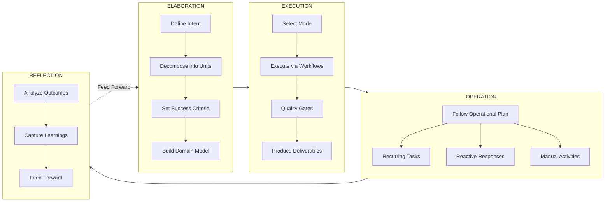
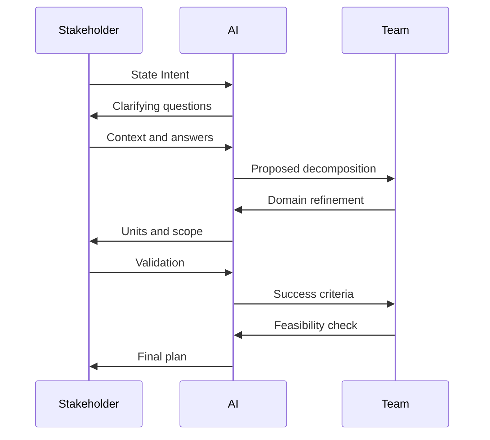
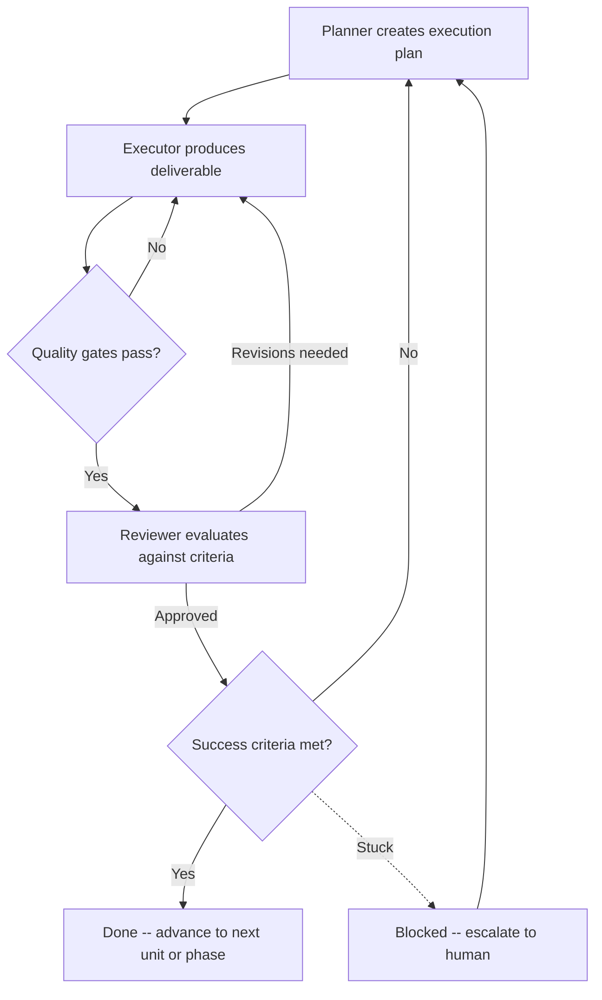
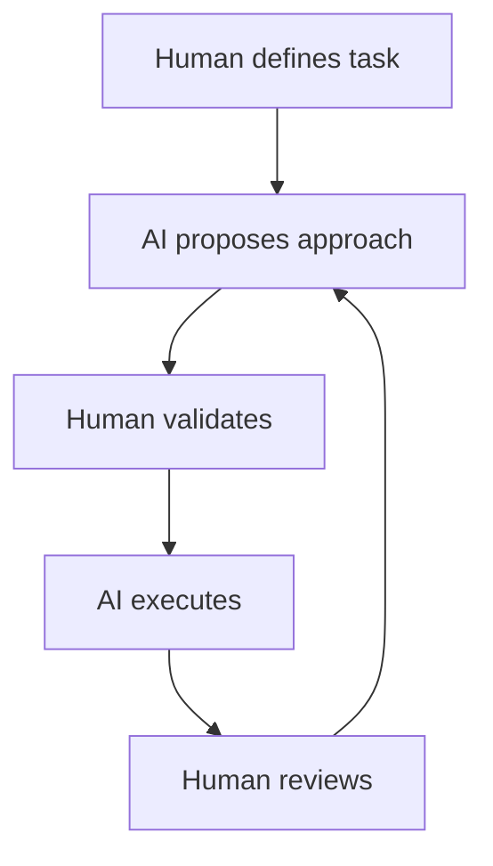
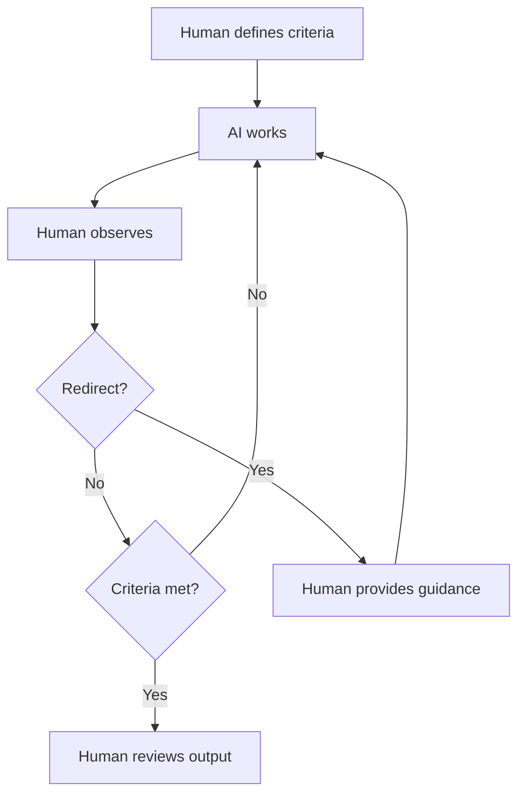
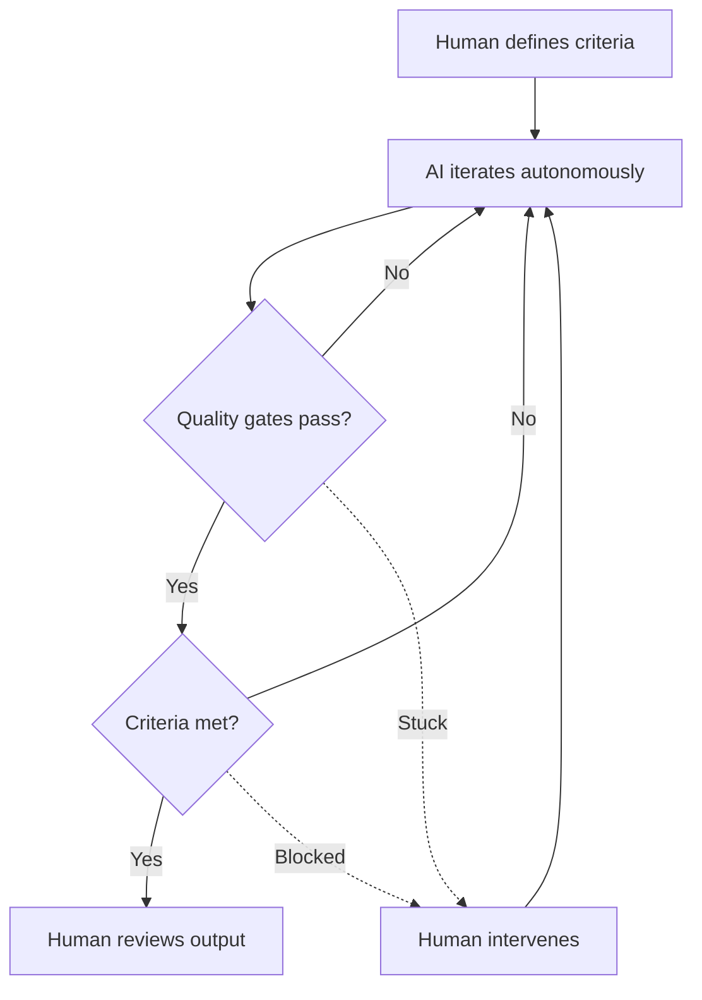
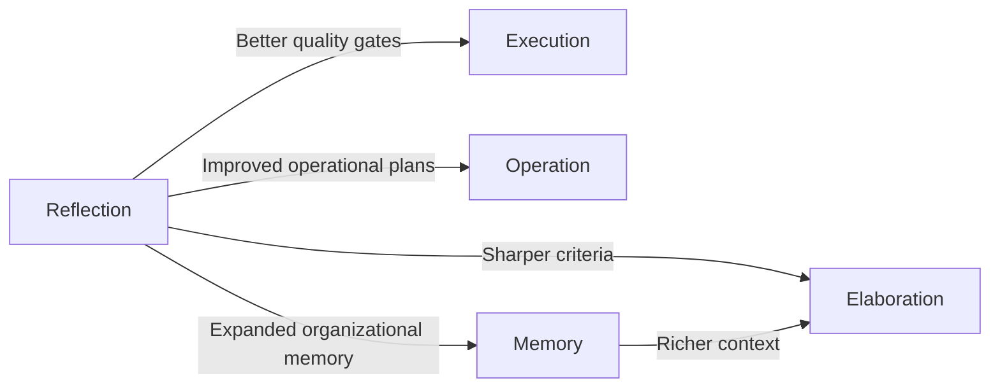
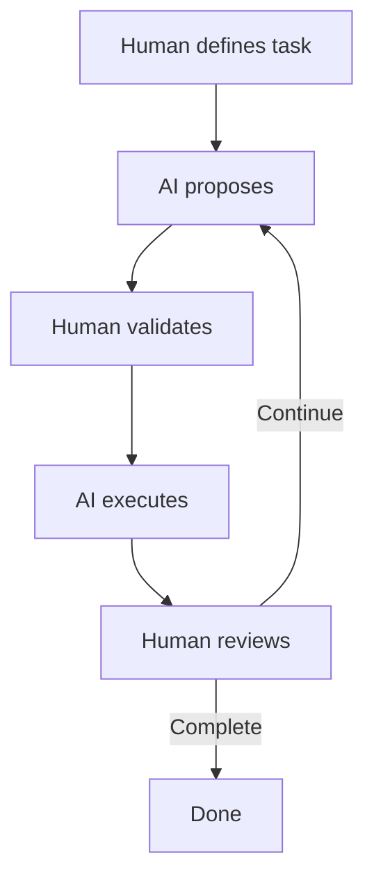
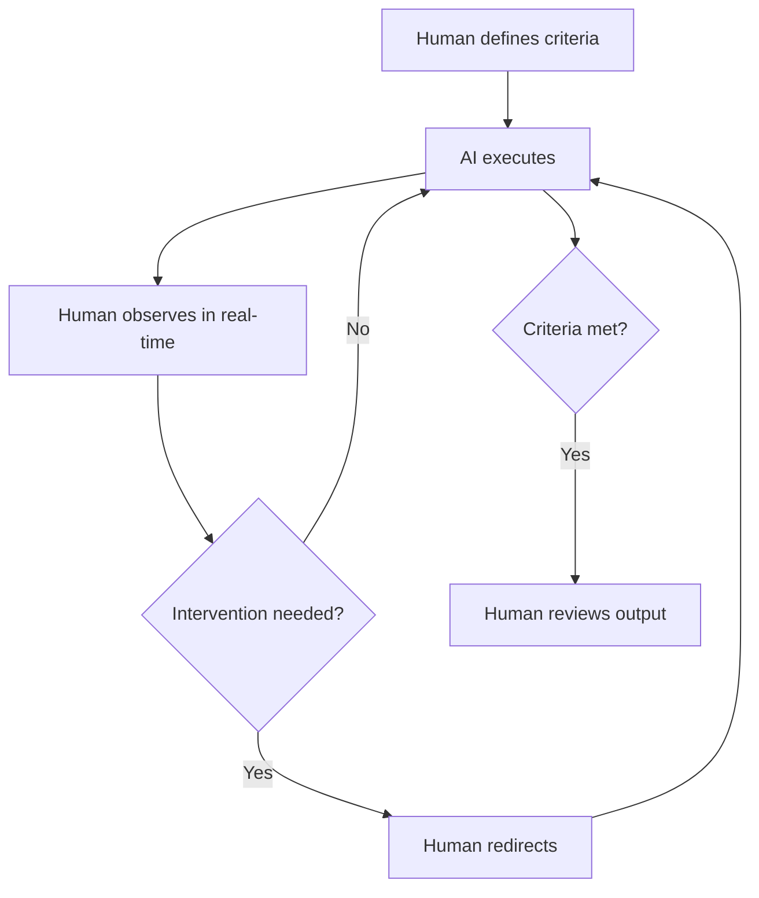
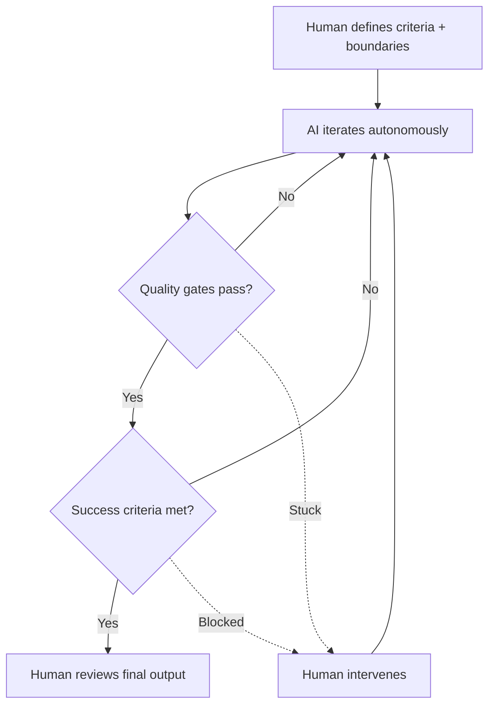

## Acknowledgments & Attribution

HAIKU builds on foundational work in human-AI collaboration methodology, generalized from production experience across multiple domains.

### Foundational Work

**Raja SP, Amazon Web Services** --- *AI-Driven Development Lifecycle (AI-DLC) Method Definition* (July 2025). The core concepts of Intent, Unit, Bolt, and the philosophy of reimagining methods rather than retrofitting AI into existing processes originate from this work.

**The Bushido Collective** --- *AI-DLC 2026* (January 2026). The software development profile that served as the first complete implementation of HAIKU principles, demonstrating backpressure-driven quality, human-on-the-loop workflows, and autonomous execution loops in production.

### Key Influences

**Geoffrey Huntley** --- The Ralph Wiggum autonomous loop methodology and the principle of backpressure over prescription.

**Steve Wilson (OWASP)** --- Human-on-the-Loop governance frameworks and the articulation of supervision modes for AI systems.

**paddo.dev** --- Analysis of phase collapse in traditional workflows and the insight that sequential handoffs become friction rather than quality control in AI-driven environments.

---

## 1. Introduction

### The Problem

Every organization faces the same challenge: structured work requires disciplined collaboration between humans and AI systems, but most teams rely on ad-hoc prompting --- improvised interactions with no persistent structure, no quality enforcement, and no learning loop.

Ad-hoc AI usage creates predictable failure modes:

| Failure Mode | Consequence |
|---|---|
| **No persistent structure** | Context lost between sessions; every interaction starts from zero |
| **No quality enforcement** | Errors propagate unchecked into deliverables |
| **No completion criteria** | "Good enough" without verification; scope creep or premature closure |
| **No mode selection** | Using autonomous approaches for work that demands supervision, or vice versa |
| **No learning loop** | The same mistakes recur; organizational knowledge never compounds |

These failures are not unique to software development. Marketing teams launching campaigns, operations teams managing processes, research teams running studies, and strategy teams executing plans all encounter the same patterns when AI collaboration lacks structure.

### HAIKU: Human AI Knowledge Unification

HAIKU is a universal framework for structured human-AI collaboration. It provides a disciplined, phase-driven methodology that governs how humans and AI systems collaborate to move from intent to outcome --- across any domain, any team structure, and any type of work.

Like the poetic form it draws its name from, HAIKU achieves clarity through constraint. Structured form channels creative energy into reliable, repeatable results.

**The name carries intention at every level:**

- **The acronym** --- Human AI Knowledge Unification --- captures the framework's purpose: unifying human judgment and AI capability into coherent, structured collaboration.
- **The poetic form** --- haiku is a Japanese poetic tradition defined by rigid structural constraints that paradoxically produce profound clarity. HAIKU the methodology works the same way: disciplined structure that produces clear, effective outcomes.
- **The cultural resonance** --- rooted in the same tradition as bushido, haiku reflects disciplined mastery and the pursuit of excellence through practice and form.

### The 4-Phase Lifecycle

Every initiative in HAIKU follows four phases:

```
Elaboration --> Execution --> Operation --> Reflection
     |                                         |
     +<------------- Feed Forward <------------+
```

1. **Elaboration** --- Define what will be done and why
2. **Execution** --- Do the work
3. **Operation** --- Manage what was delivered
4. **Reflection** --- Learn from what happened

These phases are not rigid sequential gates. They represent a continuous flow with strategic checkpoints. The same initiative may cycle through phases multiple times as understanding deepens and context evolves.

### Who This Is For

HAIKU applies to any team running structured initiatives with AI collaboration:

- **Software teams** building features, fixing defects, managing infrastructure
- **Marketing teams** planning campaigns, producing content, analyzing results
- **Operations teams** managing processes, responding to incidents, optimizing workflows
- **Research teams** designing studies, collecting data, analyzing findings
- **Strategy teams** defining goals, executing plans, measuring outcomes
- **Any team** that collaborates with AI to move from intent to outcome

The methodology is domain-agnostic by design. Domain specifics are handled through profiles --- customizable layers that adapt HAIKU's universal core to specific fields.

---

## 2. Core Principles

### Reimagine Rather Than Retrofit

Traditional methodologies --- Waterfall, Agile, Scrum, Six Sigma, PRINCE2 --- were designed for human-driven processes with long iteration cycles. Their reliance on manual workflows and rigid role definitions limits the ability to leverage AI capabilities fully. Retrofitting AI into these methods constrains its potential and reinforces outdated inefficiencies.

With AI, iteration costs approach zero. You try something, it fails, you adjust, you try again --- all in seconds, not weeks. HAIKU is built from first principles for this reality rather than adapted from methods designed for a different era.

**Traditional phase boundaries existed because iteration was expensive.** When changing deliverables meant weeks of rework, sequential phases with approval gates made economic sense. Each phase required handoffs between specialized roles, documentation to transfer context, approval gates to validate progress, and wait times for reviews.

With AI, that economic calculus inverts. Iteration is nearly free. Context loss from handoffs becomes the dominant cost. HAIKU models work as **continuous flow with strategic checkpoints** rather than discrete phases separated by gates.

### Quality Enforcement Over Prescription

Traditional methodologies prescribe *how* work should be done --- detailed process steps, review checklists, and implementation patterns that create rigid workflows. HAIKU takes a different approach: **quality gates that reject non-conforming work without dictating approach.**

Instead of specifying step-by-step procedures, define the constraints that must be satisfied. Let AI determine *how* to satisfy them.

> "Don't prescribe how; create gates that reject bad work."

Quality gates are configurable per domain:

| Domain | Example Quality Gates |
|---|---|
| Software Development | Tests pass, type checks succeed, linting clean, security scan clear |
| Marketing | Brand guidelines met, legal review passed, performance targets defined |
| Research | Methodology validated, data integrity verified, statistical significance met |
| Operations | SLA compliance confirmed, runbook validated, rollback tested |
| Strategy | Stakeholder alignment verified, risk assessment complete, metrics defined |

This approach offers multiple benefits:

- **Leverages AI capabilities fully** --- AI can apply its training and reasoning without artificial constraints
- **Reduces complexity** --- Success criteria are simpler to specify than step-by-step instructions
- **Makes success measurable** --- Verification enables autonomous operation
- **Enables iteration** --- Each failure provides signal; each attempt refines the approach

The skill shifts from directing AI step-by-step to defining criteria that converge toward correct outcomes.

### Context Preservation Through Artifacts

AI context windows reset between sessions. HAIKU addresses this through artifact-based persistence: the outputs of each phase serve as structured context for subsequent work.

**Artifacts carry knowledge across boundaries:**

- Elaboration produces intent documents, unit specifications, and success criteria
- Execution produces deliverables, progress notes, and quality gate results
- Operation produces operational plans, activity logs, and incident records
- Reflection produces analysis reports, learnings, and recommendations

This creates a self-documenting workflow. Every phase both consumes and produces artifacts that preserve context, enabling AI to resume work without rebuilding understanding from scratch.

The filesystem remains the simplest, most robust persistence mechanism. Files committed to version control, stored in shared drives, or maintained in knowledge bases provide durable memory that survives session boundaries, team transitions, and tool changes.

### Iterative Refinement Through Bolts

Work progresses through **bolts** --- iteration cycles within units. Each bolt advances the work and produces a reviewable increment. Small cycles with frequent feedback prevent drift and compound learning.

A bolt is the smallest meaningful iteration in HAIKU. Within a single unit, multiple bolts may execute sequentially or in parallel, each producing an increment that moves closer to satisfying success criteria. Quality gates provide feedback at each cycle boundary, creating a tight loop between action and assessment.

This structure applies universally:

- In software: a bolt might implement a feature, run tests, and fix failures
- In marketing: a bolt might draft content, run it through brand review, and refine based on feedback
- In research: a bolt might design an experiment, collect data, and analyze preliminary results
- In operations: a bolt might draft a runbook, simulate execution, and adjust procedures

### Human Oversight at Strategic Moments

HAIKU recognizes that human judgment remains essential but should be applied where it matters most --- not distributed uniformly across every action.

Three collaboration modes define the spectrum of human involvement:

| Mode | Human Role | AI Role |
|---|---|---|
| **Supervised** | Directs and approves every significant action | Proposes, explains, executes on approval |
| **Observed** | Monitors in real-time, intervenes when needed | Executes continuously, accepts redirection |
| **Autonomous** | Defines boundaries and reviews outcomes | Executes independently within constraints |

The appropriate mode depends on risk, complexity, novelty, and organizational trust. HAIKU supports fluid movement between modes as context changes --- even within a single unit of work.

**The human doesn't disappear. The human's function changes** --- from micromanaging execution to defining outcomes, setting quality gates, and reviewing results.

### Learning Loops

Reflection is not optional. Every completed initiative feeds learnings back into organizational memory. Future elaboration draws on past reflection. This creates a compounding advantage: teams that use HAIKU get better at using HAIKU.

**The compounding effect:**

- Success criteria get sharper as teams learn to define them
- Quality gates accumulate, creating progressively robust enforcement
- Mode selection becomes intuitive with practice
- Organizational memory expands, giving AI richer context over time
- Bolt success rates improve as patterns are established

Ad-hoc approaches don't compound --- each session starts fresh, each prompt is one-off, no organizational learning occurs. The team with HAIKU gets better at working with AI; the team with ad-hoc AI starts over every time.

---

## 3. The 4-Phase Lifecycle

### Overview



### Phase 1: Elaboration

**Purpose:** Define what will be done and why.

Elaboration transforms a broad intent into a structured plan. This phase produces the shared understanding that all subsequent work depends on. It is the most collaborative phase --- humans and AI working together to surface assumptions, resolve ambiguity, and establish measurable conditions for success.

#### Activities

**Define Intent.** Articulate the goal, scope, and desired outcome. An intent is the top-level statement of purpose --- the thing being accomplished. Every initiative begins with a clear intent.

**Decompose into Units.** Break the intent into discrete, addressable pieces of work. Each unit is cohesive (internally related), loosely coupled (minimal dependencies on other units), and independently completable. Units can declare dependencies on other units, forming a Directed Acyclic Graph (DAG) that enables parallel execution where possible and sequential execution where necessary.

**Set Success Criteria.** Establish measurable conditions that define completion --- for both individual units and the overall intent. Good success criteria are specific, measurable, verifiable, and implementation-independent. They define *what* success looks like without prescribing *how* to achieve it.

**Build Domain Model.** Capture the vocabulary, constraints, and relationships of the problem space. This shared model ensures that humans and AI use the same language and operate from the same understanding. The domain model persists as an artifact that informs all subsequent phases.

#### Elaboration Across Domains

Elaboration is not limited to software requirements. The same pattern --- intent, decomposition, criteria, domain model --- applies universally:

| Domain | Intent Example | Unit Decomposition | Success Criteria |
|---|---|---|---|
| **Software** | "Add user authentication" | API endpoints, session management, OAuth integration | Tests pass, security scan clean, load test meets thresholds |
| **Marketing** | "Launch Q2 brand campaign" | Brand brief, creative assets, channel strategy, media buy | Brand review approved, assets delivered, placements confirmed |
| **Research** | "Validate hypothesis X" | Literature review, experiment design, data collection, analysis | Methodology reviewed, data collected, statistical significance achieved |
| **Operations** | "Migrate to new vendor" | Contract negotiation, data migration, staff training, cutover | Contract signed, data verified, staff certified, SLA met |
| **Strategy** | "Enter APAC market" | Market analysis, regulatory review, partner identification, launch plan | Analysis complete, compliance confirmed, partnerships signed |

#### The Elaboration Ritual

The central activity of Elaboration is a **collaborative elaboration session** --- stakeholders and AI working together to refine the intent into actionable structure.



1. **AI asks clarifying questions** to minimize ambiguity in the original intent
2. **AI proposes decomposition** into units based on cohesion analysis
3. **The team validates** the decomposition, providing corrections and adjustments
4. **AI generates success criteria** for each unit, enabling quality enforcement
5. **The team validates criteria**, ensuring they are verifiable and complete
6. **AI recommends execution structure** --- mode selection and workflow for each unit

Elaboration is complete when every unit has clear success criteria and the decomposition covers the full intent.

#### Outputs of Elaboration

- Intent document with scope and business context
- Unit specifications with clear boundaries and dependencies
- Success criteria for each unit and for the overall intent
- Domain model capturing vocabulary and relationships
- Mode recommendations (supervised, observed, autonomous) per unit
- Execution plan with workflow assignments

### Phase 2: Execution

**Purpose:** Do the work.

Execution is where deliverables are produced. It operates through **hat-based workflows** --- ordered sequences of behavioral roles (hats) that structure how work progresses. Each unit moves through its assigned workflow in iterative cycles (bolts), with quality gates providing enforcement at each boundary.

#### Hats and Workflows

A **hat** is a behavioral role assumed during execution. Hats are not people --- they are modes of operation that define focus, constraints, and expected outputs.

Common hats include:

| Hat | Responsibility | Focus |
|---|---|---|
| **Planner** | Analyze the unit, identify approach, create execution plan | Strategy and sequencing |
| **Executor** | Produce the deliverable according to the plan | Creation and implementation |
| **Reviewer** | Evaluate deliverables against success criteria | Quality and alignment |

A **workflow** is an ordered sequence of hats that defines how a unit progresses:

```
Default:       Planner --> Executor --> Reviewer
Adversarial:   Planner --> Executor --> Challenger --> Defender --> Reviewer
Exploratory:   Observer --> Hypothesizer --> Experimenter --> Analyst
```

Workflows are configurable. Domain profiles define workflows appropriate to their field. Organizations can create custom workflows for specialized needs.

#### The Execution Loop

Within each unit, execution follows a loop structure:



**Quality gates** are the enforcement mechanism. They provide configurable verification that work meets standards before progressing. Unlike prescribed procedures, quality gates define *what must be true* without dictating *how to get there*.

Quality gates fire after every executor action. If gates fail, the executor adjusts and tries again. This creates a tight feedback loop --- fail fast, learn fast, converge toward quality.

#### Operating Modes in Execution

The three collaboration modes apply directly to execution:

**Supervised Execution.** Human approves each significant action. AI proposes, human validates, AI implements, human reviews. Used for novel, high-risk, or foundational work.



**Observed Execution.** AI works while human watches in real-time. Human can intervene at any moment but does not block progress. Used for creative, subjective, or training scenarios.



**Autonomous Execution.** AI iterates independently until success criteria are met, using quality gate results as feedback. Human reviews the final output. Used for well-defined tasks with verifiable success criteria.



#### Execution Produces Operational Plans

A critical output of execution is the **operational plan** --- a structured artifact describing how the deliverable should be managed after completion. The executor produces both the deliverable AND the operational plan, ensuring that operation is not an afterthought.

The operational plan includes:

- Recurring tasks (what must happen regularly)
- Reactive triggers (what events require response, and what the response should be)
- Manual activities (what humans must do, with AI guidance)
- Success metrics (how to measure ongoing health)
- Escalation paths (when and how to involve additional resources)

#### Outputs of Execution

- Completed deliverables for each unit
- Quality gate results demonstrating standards compliance
- Operational plan for the delivered outcome
- Progress notes and decision records
- Checkpoint artifacts at each workflow boundary

### Phase 3: Operation

**Purpose:** Manage what was delivered.

Not every initiative ends at delivery. Many require sustained activity --- monitoring, maintenance, response, and optimization. Operation governs the ongoing management of delivered outcomes, following the operational plan produced during execution.

#### Activities

**Recurring Tasks.** Scheduled, repeatable activities with AI assistance. These are predictable, periodic actions that maintain the health or effectiveness of the delivered outcome.

| Domain | Recurring Task Examples |
|---|---|
| **Software** | Dependency updates, security patch review, performance monitoring |
| **Marketing** | Content calendar execution, analytics review, campaign optimization |
| **Research** | Data collection rounds, literature monitoring, progress reporting |
| **Operations** | SLA compliance checks, vendor reviews, process audits |

**Reactive Responses.** Triggered actions in response to events or conditions. When something happens that requires attention, the operational plan defines the response protocol.

| Domain | Reactive Response Examples |
|---|---|
| **Software** | Incident response, bug triage, performance degradation |
| **Marketing** | Negative sentiment spike, competitor action, viral opportunity |
| **Research** | Unexpected data pattern, equipment failure, protocol deviation |
| **Operations** | SLA breach, vendor outage, compliance finding |

**Manual Activities with AI Guidance.** Human-led work supported by AI recommendations and context. Some operational activities require human judgment but benefit from AI's ability to synthesize information and suggest actions.

#### Operating Modes in Operation

Collaboration modes apply to Operation just as they do to Execution:

| Mode | Operation Example |
|---|---|
| **Supervised** | Human reviews every operational action before execution. Critical for high-stakes environments (financial systems, medical devices, regulated industries). |
| **Observed** | AI handles routine operations while human monitors dashboards and alerts. Human intervenes when anomalies appear. Standard for most production environments. |
| **Autonomous** | AI responds to operational events within defined boundaries, escalating only when conditions exceed its authority. Suitable for well-understood, high-volume operations. |

#### Operational Duration

Operation continues for as long as the delivered outcome requires active management. Some initiatives have a defined operational period (a campaign runs for a quarter). Others are indefinite (a production service runs until decommissioned). The operational plan specifies duration expectations and conditions for transition to either a new execution cycle or reflection.

#### Outputs of Operation

- Activity logs documenting actions taken
- Incident records for reactive responses
- Performance data against operational metrics
- Recommendations for improvement
- Transition signals (conditions met for moving to Reflection)

### Phase 4: Reflection

**Purpose:** Learn from what happened.

Reflection closes the loop. It analyzes outcomes against original intent, captures learnings, and feeds insights forward into organizational memory and future elaboration cycles. Reflection transforms experience into institutional knowledge.

#### Activities

**Analyze Outcomes.** Compare results to success criteria and original intent. Did the initiative achieve its goal? Where did it exceed expectations? Where did it fall short? What unexpected outcomes emerged?

**Capture Learnings.** Document what worked, what failed, and why. Learnings should be specific and actionable --- not abstract observations but concrete patterns that inform future work.

| Learning Category | Example |
|---|---|
| **Process** | "Autonomous mode worked well for data migration units but needed supervised mode for schema design" |
| **Quality** | "Brand review gate caught 3 issues that would have required post-launch correction" |
| **Estimation** | "Research units consistently needed 2x the expected bolt count for data collection" |
| **Collaboration** | "Stakeholder involvement during elaboration reduced revision cycles by 60% during execution" |

**Feed Forward.** Update organizational memory, refine processes, and inform the next iteration. Feed-forward is not a passive archive --- it actively shapes future work:

- Update quality gate configurations based on what gates caught (or missed)
- Refine success criteria templates based on what proved measurable (or didn't)
- Adjust mode recommendations based on what worked for different work types
- Expand domain models with new vocabulary and relationships discovered during the initiative

#### Operating Modes in Reflection

| Mode | Reflection Example |
|---|---|
| **Supervised** | Human leads the analysis, AI synthesizes data and suggests patterns. Appropriate for strategic initiatives with significant business impact. |
| **Observed** | AI generates the initial analysis and learning report; human reviews and annotates. Standard for most initiatives. |
| **Autonomous** | AI analyzes metrics, generates reports, and updates organizational memory. Human reviews a summary. Suitable for routine, well-instrumented initiatives. |

#### The Feed-Forward Loop

Reflection is what distinguishes HAIKU from one-off project management. The feed-forward loop creates organizational learning that compounds over time:



Without Reflection, organizations repeat mistakes, miss patterns, and fail to build institutional knowledge. With Reflection, every initiative makes the next one better.

#### Outputs of Reflection

- Outcome analysis comparing results to original intent
- Learning report with specific, actionable findings
- Updated organizational memory (quality gates, criteria templates, mode recommendations)
- Recommendations for future initiatives
- Feed-forward artifacts informing next elaboration cycle

---

## 4. Operating Modes

HAIKU defines three operating modes that govern how humans and AI collaborate. These modes are not fixed per initiative --- they can be configured per phase, per unit, or even adjusted mid-execution as context evolves.

### Supervised

**Human directs, AI assists. Human approves every significant action.**



**Characteristics:**
- Human approval required before each significant step
- AI explains reasoning and presents options
- Human makes trade-off decisions
- Highest human attention cost, lowest risk

**When to use Supervised mode:**
- Novel domains where patterns are not established
- High-stakes decisions with long-term or irreversible consequences
- Foundational work that shapes all subsequent activity
- Regulated environments requiring documented human approval
- Complex trade-offs requiring business context AI cannot fully possess

**Across phases:**

| Phase | Supervised Behavior |
|---|---|
| Elaboration | Human drives decomposition; AI proposes, human decides |
| Execution | Human approves each executor action before it proceeds |
| Operation | Human reviews every operational response before execution |
| Reflection | Human leads analysis; AI provides data synthesis |

### Observed

**AI executes, human monitors. Human intervenes when needed.**



**Characteristics:**
- Real-time visibility into AI's work
- Non-blocking human presence --- AI proceeds unless interrupted
- Human can redirect at any moment based on observation
- Moderate human attention cost, moderate risk

**When to use Observed mode:**
- Creative or subjective work where human taste guides direction
- Training and onboarding scenarios where observation has educational value
- Medium-risk work that benefits from human awareness without blocking approval
- Iterative refinement where frequent micro-adjustments improve outcomes

**Across phases:**

| Phase | Observed Behavior |
|---|---|
| Elaboration | AI proposes decomposition; human watches and redirects as needed |
| Execution | AI produces deliverables; human monitors and adjusts in real-time |
| Operation | AI handles operations; human watches dashboards and alerts |
| Reflection | AI generates analysis; human reviews as it develops |

### Autonomous

**AI executes independently within defined boundaries. Human reviews outcomes.**



**Characteristics:**
- AI operates within defined constraints and quality gates
- Human attention only at phase boundaries and on escalation
- Lowest human attention cost, highest trust requirement
- Quality gates provide automated enforcement in the human's absence

**When to use Autonomous mode:**
- Well-defined tasks with clear, measurable success criteria
- Verifiable work where quality gates can validate correctness
- Batch operations following established patterns
- Background work that can proceed without synchronous human attention
- High-volume, routine activities where human review of each action is impractical

**Across phases:**

| Phase | Autonomous Behavior |
|---|---|
| Elaboration | AI generates full decomposition; human reviews the complete plan |
| Execution | AI iterates to completion; human reviews final deliverables |
| Operation | AI responds to events within boundaries; human reviews summaries |
| Reflection | AI produces analysis and updates memory; human reviews report |

### Mode Selection

Choosing the right mode is a judgment call that depends on multiple factors:

| Factor | Supervised | Observed | Autonomous |
|---|---|---|---|
| **Novelty** | High --- unknown territory | Moderate --- familiar with variations | Low --- well-trodden ground |
| **Risk** | High --- consequences are severe | Moderate --- consequences are manageable | Low --- consequences are reversible |
| **Verifiability** | Low --- human judgment required | Moderate --- partial automation | High --- fully automated validation |
| **Trust** | Building --- team is learning | Established --- team has experience | High --- proven track record |
| **Volume** | Low --- few actions | Moderate --- manageable stream | High --- too many for manual review |

Teams typically start with supervised mode and progress toward autonomous as they build confidence, establish quality gates, and develop sharper success criteria. This progression is natural and expected --- HAIKU does not demand autonomous operation. It supports the full spectrum.

---

## 5. The Profile Model

### Universal Core, Domain Adaptation

HAIKU defines the universal methodology --- the 4-phase lifecycle, operating modes, hat-based workflows, quality gates, and the bolt iteration model. **Profiles** adapt this core to specific domains.

A profile customizes HAIKU by defining:

- **Domain-specific hats** --- behavioral roles tailored to the field
- **Domain-specific workflows** --- ordered hat sequences appropriate to the work
- **Domain-specific quality gates** --- verification mechanisms relevant to the domain
- **Tooling integrations** --- connections to the systems and platforms used in the domain
- **Artifact types** --- the specific deliverables the domain produces
- **Terminology mappings** --- domain vocabulary layered onto HAIKU's universal terms

The core lifecycle and principles remain constant across all profiles. Profiles add specificity without altering the foundation.

### AI-DLC: The Software Development Profile

**AI-DLC** (AI-Driven Development Lifecycle) is the software development profile of HAIKU. It was the first profile developed and serves as the reference implementation.

**Profile-specific customizations:**

| HAIKU Concept | AI-DLC Implementation |
|---|---|
| Quality gates | Tests, type checks, linting, security scans, build verification |
| Checkpoints | Git commits |
| Versioning | Git branches |
| Review | Pull/merge requests |
| Operationalization | Deployment to infrastructure |
| Operational plan | Runbooks, monitoring configuration, alert rules |
| Executor hat | Builder (with discipline awareness: frontend, backend, infrastructure) |

**AI-DLC hats:**

| Hat | Role |
|---|---|
| Planner | Analyze unit, identify approach, create execution plan |
| Builder | Implement the solution --- write code, configuration, infrastructure |
| Reviewer | Evaluate deliverables against success criteria |
| Designer | Create UI/UX designs and component specifications |
| Red Team | Adversarial testing --- find weaknesses and failure modes |
| Blue Team | Defensive response --- address weaknesses found by red team |
| Integrator | Validate cross-unit integration and merge to main |

**AI-DLC workflows:**

```
Default:       Planner --> Builder --> Reviewer
Adversarial:   Planner --> Builder --> Red Team --> Blue Team --> Reviewer
Design:        Planner --> Designer --> Reviewer
Hypothesis:    Observer --> Hypothesizer --> Experimenter --> Analyst
```

**AI-DLC quality gates:**

```
- All tests pass
- TypeScript/type system compiles with no errors
- Linter passes with zero warnings
- Security scan reports no critical/high findings
- Build succeeds
- Coverage exceeds configured threshold
```

For the full specification of the AI-DLC profile, see the *AI-DLC 2026* paper.

### SWARM: The Marketing & Sales Profile

**SWARM** (Scope, Workstreams, Accountability, Results, Memory) validates HAIKU's universality by demonstrating the framework's applicability beyond software, in the domain of marketing and sales.

**Profile-specific customizations:**

| HAIKU Concept | SWARM Implementation |
|---|---|
| Quality gates | Brand review, legal compliance, performance targets, channel requirements |
| Checkpoints | Draft reviews, stakeholder sign-offs |
| Versioning | Document versions, asset revisions |
| Review | Stakeholder approval workflows |
| Operationalization | Campaign launch, channel activation |
| Operational plan | Campaign calendar, performance dashboards, optimization triggers |
| Executor hat | Creator (with discipline awareness: copy, design, media, analytics) |

**SWARM hats:**

| Hat | Role |
|---|---|
| Strategist | Define campaign approach, audience targeting, channel mix |
| Creator | Produce content, creative assets, and campaign materials |
| Reviewer | Evaluate deliverables against brand, legal, and performance standards |
| Analyst | Measure results, identify patterns, recommend optimizations |
| Coordinator | Manage cross-workstream dependencies and stakeholder communication |

**SWARM workflows:**

```
Default:       Strategist --> Creator --> Reviewer
Performance:   Strategist --> Creator --> Analyst --> Reviewer
```

**SWARM quality gates:**

```
- Brand guidelines compliance verified
- Legal/regulatory review passed
- Target audience alignment confirmed
- Channel specifications met (dimensions, formats, character limits)
- Performance baseline established
- Budget allocation validated
```

### Creating Custom Profiles

Organizations can create profiles for any domain while inheriting HAIKU's lifecycle, principles, and collaboration model. A custom profile defines:

1. **Hats** --- What behavioral roles does your domain need?
2. **Workflows** --- In what order should hats operate?
3. **Quality gates** --- What verifiable standards must deliverables meet?
4. **Tooling** --- What systems and platforms does your domain use?
5. **Artifacts** --- What does your domain produce?
6. **Terminology** --- What domain-specific vocabulary maps to HAIKU's universal terms?

**Example: Research Profile**

```
Hats:           Literature Reviewer, Methodologist, Data Collector,
                Statistician, Peer Reviewer
Workflow:       Methodologist --> Data Collector --> Statistician
                                                --> Peer Reviewer
Quality gates:  IRB approval obtained, methodology peer-reviewed,
                data integrity verified, statistical tests appropriate,
                p-value thresholds met
Tooling:        REDCap, SPSS/R, PubMed, institutional review systems
Artifacts:      Protocol document, data collection instruments,
                analysis scripts, manuscript draft
```

The profile model means HAIKU can grow with an organization. Start with one profile for your primary domain. Add profiles as you expand AI collaboration into new areas. The core methodology stays consistent; the domain adaptation evolves.

---

## 6. Practical Examples

### Example 1: Software Feature Using the AI-DLC Profile

**Intent:** Add two-factor authentication (2FA) to the user login flow.

#### Elaboration

The team conducts a collaborative elaboration session. AI asks clarifying questions: "Which 2FA methods should be supported --- TOTP, SMS, or both?" "Should 2FA be mandatory or opt-in?" "What happens if a user loses their 2FA device?" The product owner provides answers, the engineering team adds technical constraints, and AI produces the decomposition:

**Units:**
1. `unit-01-totp-backend` --- TOTP secret generation, verification, and storage
2. `unit-02-totp-frontend` --- QR code display, setup flow, verification input
3. `unit-03-recovery-codes` --- Generate, store, and validate backup recovery codes
4. `unit-04-login-integration` --- Integrate 2FA check into existing login flow

**Success criteria for unit-01:** All tests in `tests/auth/totp/` pass. TypeScript compiles with strict mode. Security scan reports no critical findings. TOTP secrets are encrypted at rest. Rate limiting prevents brute-force attempts.

**Mode recommendation:** Units 01 and 03 are well-defined with verifiable criteria --- autonomous mode. Unit 02 involves UI decisions --- observed mode. Unit 04 touches the critical login path --- supervised mode.

#### Execution

Unit 01 runs autonomously. The planner hat analyzes the unit and creates an execution plan. The builder hat implements TOTP generation and verification, writes tests, and iterates. Quality gates (tests, type checks, lint, security scan) fire after each change. The builder adjusts until all gates pass. The reviewer hat evaluates against success criteria and approves.

Unit 02 runs in observed mode. The builder implements the QR code display and setup flow while the developer watches. The developer notices the QR code is too small on mobile and redirects: "Make the QR code responsive, minimum 200px on mobile." The builder adjusts. The developer approves the final result.

Unit 04 runs supervised. The planner proposes the integration approach. The developer reviews: "We need to handle the case where 2FA is configured but not yet verified --- show the verification screen, don't reject the login." The builder implements with the developer approving each step.

**Operational plan produced during execution:** Monitor failed 2FA attempts per user (alert if >10 in 5 minutes). Weekly review of 2FA adoption rate. Runbook for users locked out of 2FA.

#### Operation

The team follows the operational plan. AI monitors failed 2FA attempts and surfaces a pattern: a specific IP range is generating high failure rates, suggesting a credential stuffing attack. The team adds the IP range to the rate limiter. Weekly analytics show 2FA adoption at 23% after one month --- below the 40% target. The team schedules an elaboration session for a 2FA promotion campaign.

#### Reflection

After three months of operation, the team reflects. 2FA adoption reached 38%. The recovery code flow was used 47 times --- 12 of those required support intervention because users didn't understand the recovery process. Learning: "Recovery code UX needs improvement; unit-03's success criteria should have included usability testing." The operational plan is updated with a new reactive trigger: if support tickets for 2FA recovery exceed 5/week, escalate to the product team. Organizational memory is updated with sharper criteria templates for authentication features.

---

### Example 2: Marketing Campaign Using the SWARM Profile

**Intent:** Launch a brand awareness campaign for a new product line targeting small business owners in the US market.

#### Elaboration

The marketing lead states the intent. AI asks clarifying questions: "What is the budget range?" "Which channels are priorities --- digital, print, events, or all three?" "What is the timeline relative to the product launch?" "Are there existing brand assets or is this a net-new visual identity?" The team provides answers, and AI produces the decomposition:

**Units:**
1. `unit-01-brand-brief` --- Define messaging pillars, value propositions, target personas, tone of voice
2. `unit-02-creative-assets` --- Produce visual identity, hero images, ad templates, social media kit
3. `unit-03-channel-strategy` --- Define channel mix, budget allocation, scheduling, and targeting parameters
4. `unit-04-content-production` --- Write ad copy, blog posts, email sequences, landing page content
5. `unit-05-launch-execution` --- Activate channels, deploy assets, begin paid campaigns

**Success criteria for unit-01:** Brand brief approved by VP Marketing. Messaging tested with 3 focus group interviews. Value propositions map to documented customer pain points. Tone of voice guide includes 5 do/don't examples.

**Mode recommendation:** Unit 01 requires strategic judgment --- supervised mode. Units 02 and 04 involve creative work --- observed mode. Unit 03 is analytical with verifiable outputs --- autonomous mode. Unit 05 is execution with real-world consequences --- supervised mode.

#### Execution

Unit 01 runs supervised. The strategist hat proposes messaging pillars. The marketing lead reviews: "The 'save time' pillar is too generic --- make it specific to the pain of managing invoicing manually." The strategist refines. The creator hat drafts the brand brief. The marketing lead approves each section. The reviewer hat validates against success criteria.

Unit 02 runs observed. The creator hat produces hero images and ad templates while the design lead watches. The design lead redirects: "The color palette is too muted for social --- increase contrast for the Instagram variants." The creator adjusts. Quality gates verify that all assets meet channel specifications (dimensions, file sizes, color profiles).

Unit 03 runs autonomously. The strategist hat analyzes historical campaign data and recommends a channel mix. Quality gates verify budget allocation sums to 100%, all channels have targeting parameters defined, and scheduling covers the full campaign period. The reviewer hat evaluates against success criteria and approves.

**Operational plan produced during execution:** Daily performance dashboard review. Optimization trigger: if any channel's CPA exceeds target by >20%, reallocate budget. Weekly creative refresh for social channels. Bi-weekly stakeholder update.

#### Operation

The campaign launches. AI monitors performance dashboards daily. After one week, LinkedIn ads are underperforming --- CPA is 35% above target. AI triggers the optimization protocol: pause lowest-performing LinkedIn ad sets, reallocate budget to Google Search (which is exceeding targets). The team reviews the reallocation in observed mode and approves.

At the bi-weekly check-in, AI surfaces an insight: the "invoicing pain" messaging pillar is generating 3x the engagement of other pillars. The team decides to create additional content focused on this theme for the second half of the campaign.

#### Reflection

After the 12-week campaign concludes, the team reflects. Brand awareness (measured by unaided recall survey) increased from 4% to 18% among the target audience --- exceeding the 15% goal. Cost per engagement was 12% below budget. LinkedIn underperformed throughout despite optimization. Learning: "For B2B small business audiences, LinkedIn's broad targeting is less effective than Google Search intent targeting. Future campaigns should allocate LinkedIn budget to search and social proof content." Organizational memory is updated. Success criteria templates for future campaigns are refined to include channel-specific performance thresholds established during the first week rather than pre-set targets.

---

### Example 3: Strategic Planning Using HAIKU Core

**Intent:** Define and execute a three-year strategic plan for expanding into the European market.

This example uses HAIKU core without a specialized profile, demonstrating that the framework functions without domain-specific customization.

#### Elaboration

The executive team states the intent. AI conducts the elaboration session, asking questions that surface assumptions: "Which European markets are priorities --- EU-wide or specific countries?" "What regulatory frameworks apply to your product category?" "Do you have existing European customers or partnerships?" "What is the competitive landscape in target markets?"

**Units:**
1. `unit-01-market-analysis` --- Analyze target markets, competitive landscape, regulatory requirements
2. `unit-02-regulatory-review` --- Map compliance requirements per target country, identify certification needs
3. `unit-03-partnership-strategy` --- Identify potential partners, define partnership models, create outreach plan
4. `unit-04-go-to-market` --- Define pricing, positioning, channel strategy, and launch sequence per market
5. `unit-05-resource-plan` --- Define hiring needs, office locations, budget requirements, organizational structure

**Success criteria for unit-01:** Analysis covers top 5 target markets. Competitive landscape maps minimum 3 competitors per market. Regulatory overview identifies all applicable frameworks. Market sizing includes TAM, SAM, SOM with cited sources.

**Mode recommendation:** All units run in supervised mode. Strategic planning involves high-stakes decisions with long-term consequences, and the deliverables require executive judgment that cannot be automated.

#### Execution

The executor hat produces each deliverable with the executive team reviewing at every stage. For unit-01, AI synthesizes market data, competitor information, and regulatory frameworks into a structured analysis. The executive team validates assumptions, corrects misinterpretations, and adds context that AI cannot access (confidential conversations with potential customers, board-level constraints).

For unit-04, the go-to-market plan goes through multiple bolts. The first bolt produces a pricing analysis that the CFO rejects: "We can't use US pricing with currency conversion --- European markets expect local pricing that reflects local competitive dynamics." The planner revises. The second bolt produces a revised pricing model that the team approves.

**Operational plan produced during execution:** Quarterly strategic review against milestones. Monthly market monitoring for regulatory changes. Bi-annual competitive landscape refresh. Escalation triggers for budget variance >15% or regulatory changes affecting market entry.

#### Operation

Over the following year, the team operates against the strategic plan. AI monitors regulatory developments and surfaces a change: a new data protection regulation in the primary target market will require product modifications. This triggers the escalation protocol. The team conducts a focused elaboration session to create a new intent for product compliance, which flows through its own HAIKU lifecycle.

Quarterly reviews compare actual progress against the plan. AI produces the comparison, highlighting that partnership development is ahead of schedule but hiring is behind. The team adjusts resource allocation.

#### Reflection

After the first year, the team reflects on Phase 1 of the strategy. Two of five target markets were entered on schedule. The third was delayed by the regulatory change (addressed through the compliance intent). Key learning: "Regulatory analysis should include not just current frameworks but anticipated changes --- build a forward-looking regulatory monitoring capability into all future market entry plans." The feed-forward loop updates the elaboration templates: future market entry intents now include a mandatory "regulatory horizon scanning" unit.

---

## 7. Adoption

### Start Where You Are

HAIKU is designed for incremental adoption. You do not need to implement all four phases, all operating modes, and a custom profile before deriving value. Start with what solves your most immediate pain point and expand as you build confidence.

### Step 1: Start with Elaboration

The highest-leverage starting point is Elaboration. Most teams struggle not with execution but with ambiguity --- unclear goals, undefined success criteria, and decomposition that doesn't match reality.

**To adopt Elaboration:**
1. Before your next initiative, conduct a collaborative elaboration session with AI
2. Define the intent explicitly --- write it down, not just discuss it
3. Decompose into units with clear boundaries
4. Set measurable success criteria for each unit
5. Share the elaboration output with the team before starting work

**What you gain immediately:**
- Reduced ambiguity before work begins
- Shared understanding across the team
- Measurable criteria that define "done"
- A structured artifact that persists across sessions

Most teams report that Elaboration alone transforms their work quality, because it forces explicit articulation of what was previously implicit.

### Step 2: Add Execution Structure

Once Elaboration is comfortable, add structure to how you execute.

**To adopt Execution:**
1. Assign workflows to units (even if just the default: planner, executor, reviewer)
2. Define quality gates appropriate to your domain
3. Choose an operating mode for each unit
4. Track progress through bolts --- each iteration is a reviewable increment

**What you gain:**
- Consistent process for how work progresses
- Quality enforcement that catches issues before review
- Visibility into progress through bolt-level tracking
- Mode selection that matches human attention to work characteristics

### Step 3: Extend into Operation

Not all initiatives require active operation. But for those that do, adding operational structure prevents the common pattern of "ship and forget."

**To adopt Operation:**
1. During execution, produce an operational plan alongside the deliverable
2. Define recurring tasks, reactive triggers, and manual activities
3. Choose an operating mode for operational work
4. Monitor against the plan and adjust as needed

**What you gain:**
- Continuity between execution and ongoing management
- Defined protocols for routine and exceptional situations
- AI assistance for operational monitoring and response
- Reduced "institutional amnesia" when teams rotate

### Step 4: Close the Loop with Reflection

Reflection completes the lifecycle and creates the compounding advantage that distinguishes HAIKU from one-off process improvements.

**To adopt Reflection:**
1. After each initiative (or at defined intervals), conduct a reflection session
2. Compare outcomes to original intent and success criteria
3. Capture specific, actionable learnings
4. Update organizational memory --- quality gates, criteria templates, mode recommendations
5. Feed forward into the next elaboration cycle

**What you gain:**
- Organizational learning that compounds over time
- Progressively sharper success criteria
- Continuously improving quality gates
- Institutional knowledge that survives team changes

### Progression Is Natural

Teams naturally progress through adoption stages as they build confidence:

```
Elaboration only
     |
     v
Elaboration + Execution
     |
     v
Elaboration + Execution + Operation
     |
     v
Full lifecycle (all 4 phases)
     |
     v
Full lifecycle + custom profile
     |
     v
Full lifecycle + multiple profiles across domains
```

Each stage builds on the previous one. There is no pressure to reach the final stage --- even "Elaboration only" delivers significant value. The methodology meets you where you are.

### Scaling Across an Organization

Once a team has adopted HAIKU successfully, the pattern spreads naturally:

- **Within a team:** Start with one initiative, expand to all initiatives
- **Across teams:** One team's success creates a template for others
- **Across domains:** Software team's HAIKU practice inspires marketing, operations, or strategy teams
- **Across the organization:** Shared HAIKU principles create a common language for human-AI collaboration

The profile model supports this scaling. Each domain creates or adopts a profile that fits its needs while sharing the universal lifecycle, principles, and operating modes. Cross-domain collaboration becomes easier because everyone shares the same fundamental structure, even if the domain-specific details differ.

---

## Glossary

| Term | Definition |
|---|---|
| **Bolt** | An iteration cycle within a unit --- each bolt advances the work and produces a reviewable increment |
| **Collaboration Mode** | The human-AI interaction pattern: Supervised, Observed, or Autonomous |
| **Deliverable** | The work output of a unit --- the thing being produced |
| **Elaboration** | The first phase: defining intent, decomposing into units, setting success criteria |
| **Execution** | The second phase: doing the work through hat-based workflows |
| **Feed Forward** | The mechanism by which reflection outputs inform future elaboration |
| **Hat** | A behavioral role assumed during execution (e.g., planner, executor, reviewer) |
| **HAIKU** | Human AI Knowledge Unification --- a universal framework for structured human-AI collaboration |
| **Intent** | The top-level goal or initiative --- the thing being accomplished |
| **Operation** | The third phase: managing what was delivered |
| **Operational Plan** | An artifact produced during execution that defines how the deliverable should be managed |
| **Phase** | A stage in the lifecycle: Elaboration, Execution, Operation, or Reflection |
| **Profile** | A domain-specific implementation of HAIKU (e.g., AI-DLC for software, SWARM for marketing) |
| **Quality Gate** | A configurable verification checkpoint that provides enforcement |
| **Reflection** | The fourth phase: learning from what happened and feeding forward |
| **Success Criteria** | Measurable conditions that define when work is done |
| **Unit** | A discrete piece of work within an intent |
| **Workflow** | An ordered sequence of hats that defines how a unit progresses |
